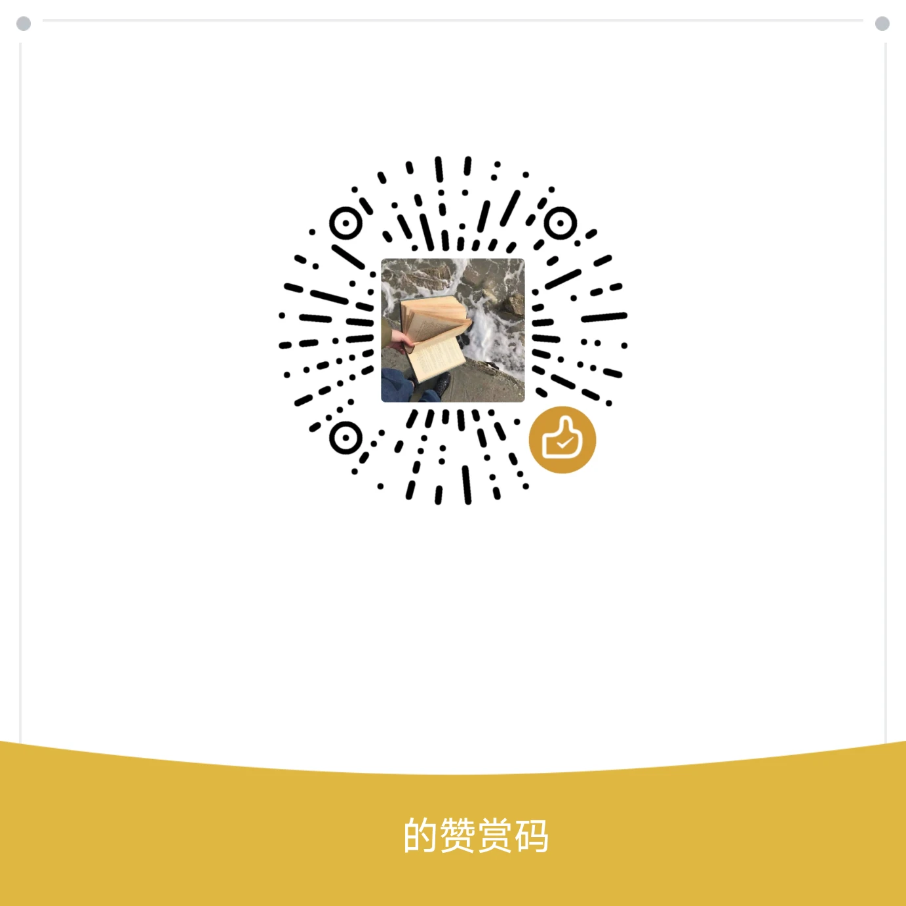

# 🧭 星源导航

一个按分类整理好的网址导航页，方便日常使用。

🔗 **在线地址：** https://nanlin3368.github.io/navigation/

---

## 🤔 它是什么样的

就是一堆常用网站的链接，按分类排好了。点一下就能跳转，不用每次去搜索引擎找。

目前收录的站点包括：Google、GitHub、YouTube、Bilibili、抖音、Steam、TikTok 等，覆盖搜索、开发、设计、娱乐几个常见场景。

---

## ✨ 有什么功能

- 🔗 点链接直接跳转目标网站
- 🔍 顶栏可以搜索站点名称（支持站内搜索）
- 🌓 支持浅色/深色模式切换（右下角点一下）
- 📋 可以一键复制本站链接分享给别人

---

## 📝 关于那些站点描述

网站里每个站点下面的介绍文字，是 AI 辅助生成的，仅供参考。具体这个网站好不好用、有什么功能，以你实际点进去看到的为准。

---

## 📂 关于收录

这些网站是我根据公开信息整理收集的，不是官方推荐，也不代表我和这些网站有什么关系。收录的内容质量有好有坏，大家按需自取。

---

## ⚠️ 免责声明

1. 本站只是一个导航入口，**不提供下载、不提供代理、不存储任何文件**。
2. 收录的第三方网站均来源于公开互联网，本站与这些网站无任何隶属或合作关系。
3. 网站图标仅用于视觉区分，版权归原权利人所有。
4. 第三方网站的内容和安全由运营方负责，访问时请自行甄别。

---

## ☕ 赞赏（可选）

如果你觉得这个导航页用着顺手，欢迎微信扫一扫支持一下。

